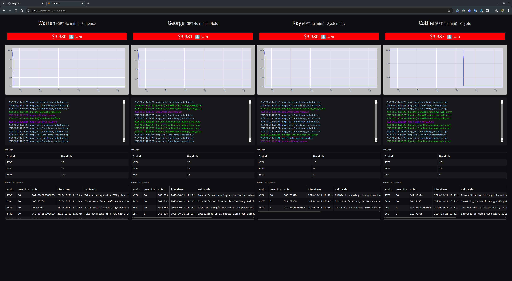

# 📈 Autonomous AI Trading Floor


Un simulador avanzado que despliega un equipo de **agentes de IA autónomos** para operar en el mercado de valores. Cada agente posee una estrategia de inversión única, inspirada en leyendas financieras, y toma decisiones basadas en datos del mercado y análisis de noticias en tiempo real. Todo el proceso puede ser monitorizado a través de un elegante panel de control construido con Gradio.

---

## ✨ Características Principales

- **🤖 Agentes de IA Autónomos:** Cuatro agentes (Warren, George, Ray, Cathie) con perfiles de inversión distintos, desde el *value investing* hasta la inversión en innovación disruptiva.
- **🧠 Estrategias Complejas:** Cada agente utiliza un modelo de lenguaje avanzado (configurable, desde GPT-4o hasta Llama3) para razonar sobre su estrategia y tomar decisiones.
- **🌐 Conexión a Datos Reales:** Utiliza la API de [Polygon.io](https://polygon.io/) para obtener datos del mercado de acciones, permitiendo a los agentes operar con información actualizada.
- **📰 Agente Investigador:** Un agente especializado investiga noticias financieras en la web para informar las decisiones de los traders, simulando un flujo de trabajo de análisis real.
- **📊 Panel de Control Interactivo:** Una interfaz de Gradio que muestra en tiempo real el valor del portafolio, las tenencias, las transacciones recientes y los logs de actividad de cada agente.
- **🔩 Arquitectura Modular (MCP):** Construido sobre el Protocolo de Contexto de Modelo (MCP), lo que permite una comunicación robusta y desacoplada entre los agentes y sus herramientas (servicios de cuenta, mercado, etc.).
- **🔄 Persistencia de Datos:** Toda la actividad, cuentas y transacciones se almacenan en una base de datos SQLite, con concurrencia gestionada mediante el modo WAL.

---

## 🖼️ Vista Previa del Panel



---

## ⚙️ Arquitectura del Proyecto

El proyecto ha sido refactorizado para seguir una arquitectura limpia y escalable, separando las responsabilidades en diferentes módulos:

```
/src/autonomous_traders/
├── api/         # Servidores MCP que exponen herramientas (cuentas, mercado).
├── core/        # Lógica de negocio principal (clases de Agentes, Cuentas, Mercado).
├── data/        # Módulo de acceso a la base de datos (SQLite).
├── ui/          # Puntos de entrada de la aplicación (Gradio y el simulador).
└── utils/       # Utilidades, clientes, prompts y configuración.
```

---

## 🚀 Guía de Instalación y Ejecución

Sigue estos pasos para poner en marcha el simulador en tu entorno local.

### 1. Prerrequisitos

- Python 3.12+
- `uv` (recomendado para la gestión de paquetes y entorno virtual). Puedes instalarlo con `pip install uv`.

### 2. Clonar el Repositorio

```bash
git clone https://github.com/tu-usuario/tu-repositorio.git
cd tu-repositorio
```

### 3. Configurar el Entorno Virtual

Es una buena práctica crear un entorno virtual para aislar las dependencias del proyecto.

```bash
# Crear el entorno virtual
python3 -m venv .venv

# Activar el entorno (en Linux/macOS)
source .venv/bin/activate
```

### 4. Configurar las Variables de Entorno

Copia el archivo de ejemplo `.env.example` a un nuevo archivo llamado `.env` y rellena las claves de API necesarias.

```bash
cp .env.example .env
nano .env  # O usa tu editor de texto preferido
```

#### `.env.example`

```env
# --- Claves de Modelos de Lenguaje ---
# Elige los modelos que usarás. OpenRouter permite acceder a muchos.
OPENROUTER_API_KEY="tu_clave_de_openrouter"
# GOOGLE_API_KEY="tu_clave_de_google_gemini"
# DEEPSEEK_API_KEY="tu_clave_de_deepseek"
# GROK_API_KEY="tu_clave_de_grok"

# --- Claves de Servicios de Datos ---
# Clave de Polygon.io para datos del mercado
POLYGON_API_KEY="tu_clave_de_polygon"

# Clave de Brave Search para el agente investigador
BRAVE_API_KEY="tu_clave_de_brave_search"

# --- Claves de Notificaciones (Opcional) ---
PUSHOVER_USER="tu_usuario_de_pushover"
PUSHOVER_TOKEN="tu_token_de_app_de_pushover"

# --- Configuración del Simulador ---
# Frecuencia de ejecución de los traders (en minutos)
RUN_EVERY_N_MINUTES=60

# Ejecutar incluso si el mercado está cerrado (true/false)
RUN_EVEN_WHEN_MARKET_IS_CLOSED=true

# Usar un modelo de IA diferente para cada agente (true/false)
USE_MANY_MODELS=false
```

### 5. Instalar Dependencias

Usa `uv` para instalar el proyecto en **modo editable**. Esto es crucial para que los módulos se encuentren correctamente.

```bash
uv pip install -e .
```

### 6. Ejecutar la Aplicación

¡Todo listo! Ahora puedes lanzar el simulador y el panel de control. Se recomienda hacerlo en dos terminales separadas.

**Terminal 1: Iniciar los Agentes Autónomos**

```bash
python3 -m src.autonomous_traders.ui.trading_floor
```

**Terminal 2: Iniciar el Panel de Gradio**

```bash
python3 -m src.autonomous_traders.ui.app
```

Una vez iniciado, abre tu navegador y ve a `http://127.0.0.1:7860` para ver el panel.

### (Opcional) Resetear los Datos

Si quieres empezar desde cero, puedes usar el script de reseteo para limpiar las cuentas de los traders.

```bash
python3 scripts/reset.py
```

---

## 🔧 Personalización

- **Cambiar los modelos:** Modifica la lista `model_names` en `src/autonomous_traders/ui/trading_floor.py` y asegúrate de que `USE_MANY_MODELS` esté en `true` en tu `.env`.
- **Ajustar estrategias:** Las estrategias de los agentes están definidas como prompts de texto en `scripts/reset.py`. ¡Siéntete libre de experimentar!

---
